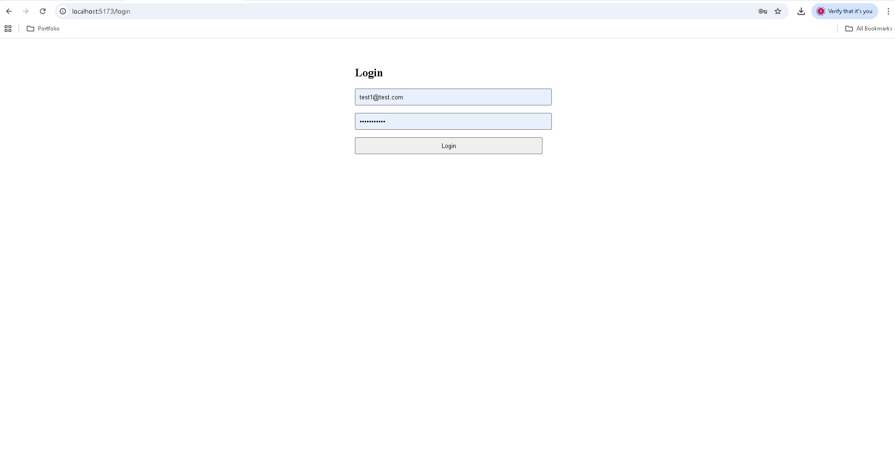
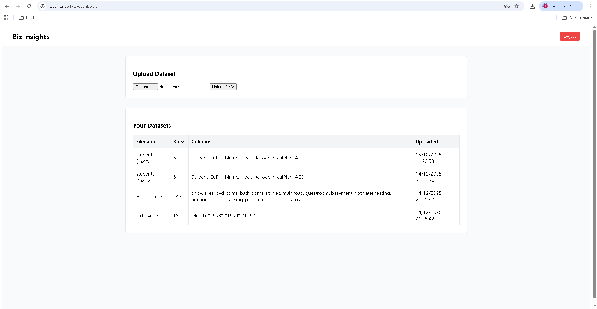
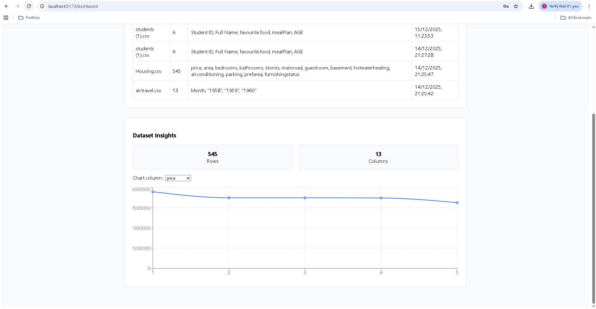

# 📌 Biz Insights Frontend
A modern React-based dashboard for uploading CSV datasets, exploring insights, and visualizing data through interactive charts.

---

---

## 📑 Table of Contents

- ✨ [Features](#-features)
- 🧰 [Tech Stack](#-tech-stack)
- 🗂️ [Project Structure](#-project-structure)
- 📸 [Screenshots](#-screenshots) 
- ▶️ [Running Locally](#-running-locally)
- 🚀 [Future Improvements](#-future-improvements)
- 👤 [Author](#-author)

---

## ✨ Features

- 🔐 **Authentication & Access**
  - Secure JWT-based authentication
  - Login & logout flow
  - Protected dashboard routes
  - Token-based session handling

- 📁 **Dataset Management**
  - CSV file upload interface
  - User-specific dataset storage
  - Dataset listing with metadata (rows, columns, upload date)
  - Dataset preview (first rows)

- 📊 **Data Insights & Visualization**
  - Automatic column type detection (numeric vs categorical)
  - Interactive line charts using Recharts
  - Dynamic numeric column selection
  - Real-time chart updates

- 📈 **Statistical Analysis**
  - Minimum value calculation
  - Maximum value calculation
  - Average (mean) calculation
  - Displayed alongside charts for context

- 🧱 **Clean Frontend Architecture**
  - Modular React components
  - Centralized API handling with Axios
  - React Router for page navigation
  - Separation of UI, logic, and data fetching

- 🚀 **Future-Ready Design**
  - Easily extendable chart types
  - Backend-agnostic REST API integration
  - Ready for deployment (Vercel / Netlify)

--- 

## 🧰 Tech Stack

- **React 18**
- **Vite**
- **Recharts**
- **Axios**
- **React Router**
- **JWT Authentication**
- **REST API (Node.js + Express backend)**

---

## 📸 Screenshots

### Login

### Dashboard
Upload CSV files and manage datasets.

### Dataset Insights
Automatic detection of column types and data preview.

### Charts
Interactive charts with dynamic column selection.

---

## ▶️ Running Locally

### Prerequisites
- Node.js (v18+ recommended)
- Backend running locally (see backend repo)

### Installation

npm install

## Start Development Server

npm run dev

## Frontend will run at

http://localhost:5173

---

## 🧠 What I Learned

Developing the frontend for Biz Insights improved my practical React and frontend architecture skills, including:

- Managing **authentication state** using JWTs stored in localStorage
- Protecting routes and redirecting users based on auth status
- Building **data-driven dashboards** using React hooks (`useState`, `useEffect`)
- Fetching and handling asynchronous API data with Axios
- Visualising real datasets using **Recharts**
- Dynamically updating charts based on selected columns and datasets
- Handling file uploads and multipart form data from the browser
- Structuring a clean, scalable frontend using pages, services, and reusable logic

This project reinforced how frontend and backend systems communicate in a full-stack application.

---

### 🚀 Future Improvements
- UI styling & theme improvements
- Multiple chart types (bar, pie)
- Pagination for large datasets
- Dataset deletion & editing
- Deployment (Vercel / Netlify)

---